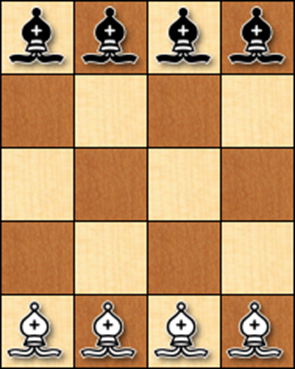
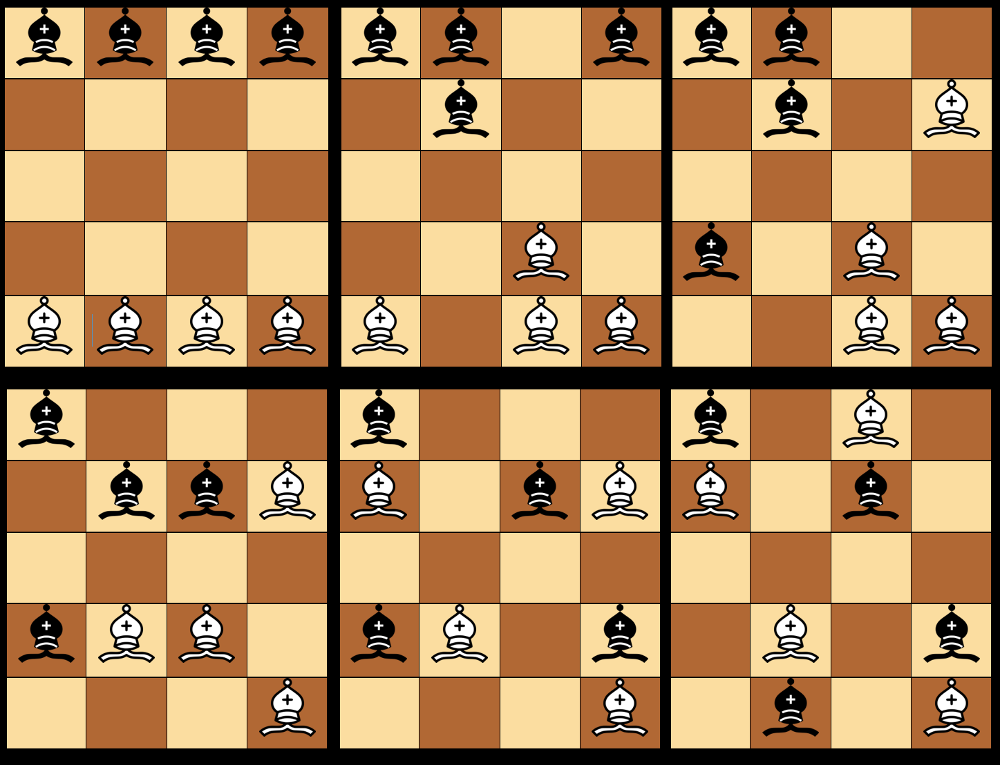
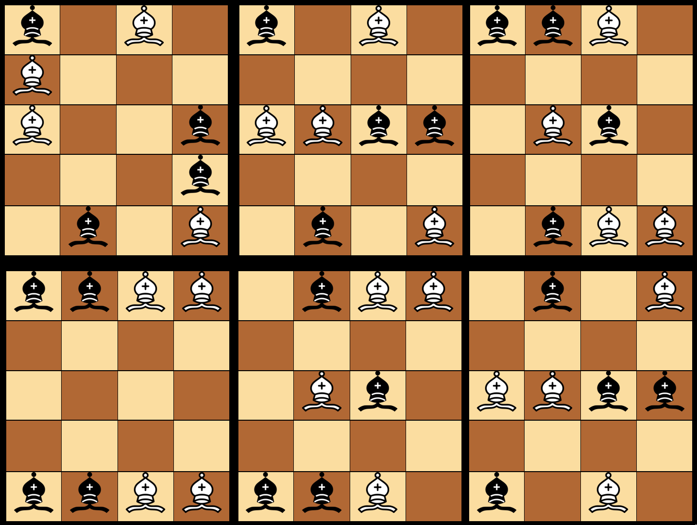
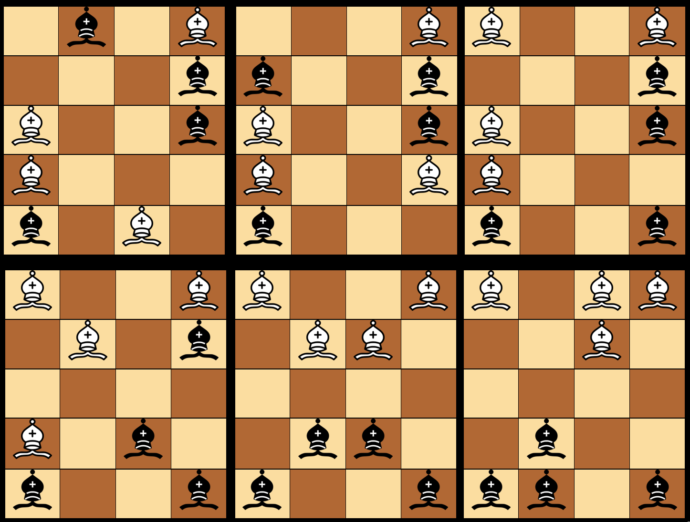
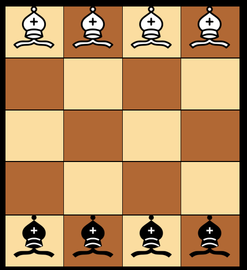

# Introducción a la Inteligencia Artificial: Introspección

El problema planteado es el siguiente:
Coloca ocho alfiles (cuatro negros y cuatro blancos) en un tablero de ajedrez reducido, tal como se ve en la figura. El problema consiste en hacer que los alfiles negros intercambien sus posiciones con los blancos, ningún alfil debe atacar en ningún momento otro del color opuesto. Se deben alternarlos movimientos, primero uno blanco, luego uno negro, luego uno blanco y así sucesivamente. ¿Cuál es el mínimo número de movimientos en que se puede conseguir?

Primero que nada, hay que tener claro cómo es que se mueven los alfiles en el ajedrez, se mueven en líneas diagonales a lo largo del tablero. La regla es que un alfil puede moverse en cualquier dirección diagonal, avanzando hacia adelante o hacia atrás, siempre que se mantenga en las casillas del mismo color. Esto significa que un alfil que comienza en una casilla blanca solo puede moverse a otras casillas blancas y viceversa.

Para ser más específico, un alfil puede moverse en líneas diagonales hasta que alcance el borde del tablero o una pieza propia u oponente. No hay restricciones en la distancia que puede recorrer en una sola jugada, siempre y cuando siga moviéndose en la misma dirección diagonal. 
En el contexto específico de un tablero de ajedrez de 4x5, donde los alfiles deben intercambiar posiciones sin realizar movimientos de ataque entre ellos, sigue aplicándose la regla básica de movimiento de los alfiles en líneas diagonales. La diferencia aquí es que debes tener en cuenta las dimensiones del tablero y garantizar que, al realizar los movimientos, los alfiles no ataquen a otros del color opuesto.

Posibles estrategias para resolver el problema:

•	Movimientos Simétricos o Copias:
Mueve un alfil blanco en una dirección diagonal.
Realiza el movimiento simétrico correspondiente con el alfil negro en la dirección opuesta.
Ten en cuenta que los alfiles no coinciden en el color de la casilla base debido al tamaño y distribución del tablero.

•	Alfiles que Nunca se Atacarán:
Observa los alfiles ubicados en casillas blancas versus casillas negras.
Aprovecha que estos alfiles nunca se atacarán entre sí.
Utiliza esta información para realizar movimientos seguros sin temor a ataques.

•	Casillas Seguras para Movimientos:
Identifica las casillas a las que los alfiles pueden moverse sin atacar a otros.
Estas casillas cambian en cantidad y posición dependiendo de la disposición de los alfiles en el tablero.
Utiliza estas casillas seguras para planificar movimientos que no rompan las reglas del juego.

•	Movimientos Alternados:
Mantén la alternancia entre alfiles blancos y negros en cada movimiento.
Asegúrate de que en cada paso, los alfiles no se ataquen mutuamente y cumplan con las reglas básicas del ajedrez.

•	Visualización y Planificación:
Utiliza un sistema de coordenadas para simplificar la descripción y visualización de los movimientos.
Planifica cada movimiento con anticipación, teniendo en cuenta las observaciones sobre movimientos simétricos, alfiles que no se atacarán y casillas seguras.

•	Iteración y Ajuste:
Realiza movimientos secuenciales, evaluando y ajustando a medida que avanzas.
Experimenta con diferentes combinaciones de movimientos para minimizar el número total necesario.

A continuación, se representa gráficamente los intercambios a realizar.

## Conclusión
Como podemos observar en las imagenes, descartando la posición inicial cada jugador requiere de 18 movimientos, ya que en cada movimiento del alfil que hagamos, tenemos que asegurarnos de no atacar a otro, el problema se puede resolver de manera más sencilla, pero como tenemos la limitante de no ataques por eso es importante realizar tanto movimiento.