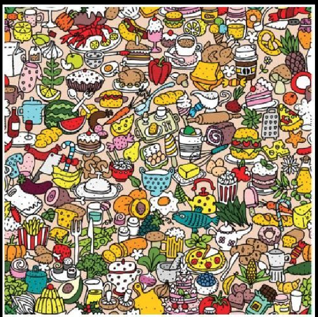

# Introducción a la Inteligencia Artificial: Intro-spección


Adentrarse en la programación para identificar objetos rojos en imágenes nos lleva más allá de la tarea simple de contar. En este viaje, se entrelazan la lógica humana y la precisión matemática en un terreno fascinante.

Contar manzanas rojas en una imagen implica desafíos conceptuales desde el inicio. Definir el "rojo" es aparentemente fácil, pero ¿cómo manejamos matices cercanos al naranja? Aquí comienza nuestra odisea conceptual, donde la abstracción y la interpretación subjetiva entran en juego.

Delimitar colores se convierte en un rompecabezas. ¿En qué punto deja de ser rojo y se vuelve naranja o púrpura? Máquinas usan modelos como RGB, mientras humanos confían en intuición para determinar límites.

Al contar objetos rojos, desplegamos la magia de nuestros cerebros. Distinguimos colores y contornos, pero ¿cómo traducir esto a procesos matemáticos precisos? La comparación entre enfoques iterativos y recursivos revela la danza entre la abstracción humana y la precisión de máquinas.

La inteligencia artificial (IA), nuestra aliada digital, examina imágenes y resuelve desafíos como contar objetos rojos. Es como ese amigo astuto que simplifica las cosas, fusionando intuición humana y precisión matemática.

Podemos notar que lo que parece simple se convierte en una odisea de abstracciones. Humanos aportan intuición, máquinas brindan precisión, y la IA fusiona ambos mundos. Así, contar objetos rojos es una travesía fascinante en el universo de la programación.

Explorar este camino revela cómo asignamos valores a píxeles en una matriz para representar imágenes digitalmente. La complejidad radica en desarrollar algoritmos que identifiquen no solo el color "rojo", sino sus matices, donde la abstracción y subjetividad se entrelazan.

La inteligencia artificial emerge como aliada, examinando patrones y aprendiendo de ellos. Modelos de aprendizaje profundo permiten discernir matices, superando limitaciones tradicionales. La programación para identificar objetos rojos no se reduce a colores, también implica entender la disposición de píxeles y estructuras en imágenes.

En resumen, exploramos un camino que fusiona intuición humana, precisión matemática y aprendizaje de la inteligencia artificial. Cada línea de código desvela misterios, y cada iteración nos sumerge más en la complejidad del universo de programación e inteligencia artificial.

A continuación se proporciona el codigo generado para detectar los objetos de color rojo en la imagen proporcionada y una descripción de su funcionamiento.

Este código en Python utiliza la biblioteca OpenCV para procesar una imagen y contar objetos de color rojo en ella. Aquí están los pasos detallados:

1. **Importación de bibliotecas:**
   Se importa la biblioteca OpenCV con el alias "cv".

2. **Carga de la imagen:**
   Se carga la imagen (proporcionada en Teams) desde el archivo 'tr.png' en el directorio 'C:/Users/gonza/Downloads/'. El segundo argumento (1) indica que la imagen se carga a color (BGR).

3. **Conversión de espacios de color:**
   Se convierte la imagen de BGR a RGB y luego de RGB a HSV (Matiz, Saturación, Valor).

4. **Definición de umbrales para el color rojo en HSV:**
   Se definen umbrales bajos y altos para el rango de colores rojos en el espacio de color HSV.

5. **Creación de máscaras para el color rojo:**
   Se crean máscaras para resaltar los píxeles que caen dentro del rango de colores rojos definido por los umbrales.

6. **Aplicación de máscara a la imagen original:**
   La máscara se aplica a la imagen original para resaltar los objetos de color rojo.

7. **Visualización de resultados:**
   Se muestra la imagen resultante con los objetos de color rojo resaltados y la imagen original.

8. **Detección de contornos en la máscara:**
   Se encuentran los contornos en la máscara de color rojo.

9. **Recorrido de contornos y obtención de coordenadas:**
   Se recorren los contornos y se obtienen las coordenadas del centro de cada contorno si el área no es cero.

10. **Impresión de resultados:**
    Se imprime el total de objetos rojos y sus coordenadas en la imagen.

11. **Espera de tecla y cierre de ventanas:**
    La ejecución espera a que se presione una tecla y luego cierra todas las ventanas abiertas por OpenCV.

```
import cv2 as cv
img = cv.imread('C:/Users/gonza/Downloads/tr.png',1)
img2 = cv.cvtColor(img, cv.COLOR_BGR2RGB)
img3 = cv.cvtColor(img2, cv.COLOR_RGB2HSV)

umbralRojoBajo=(0,80,80)
umbralRojoAlto=(10,255,255)
umbralRojoBajob=(140,80,80)
umbralRojoAltob=(255,255,255)

mascara1Rojo= cv.inRange(img3, umbralRojoBajo, umbralRojoAlto) # Resalta los colores rojos
mascara2Rojo= cv.inRange(img3, umbralRojoBajob, umbralRojoAltob) # Resalta los colores rojos
mascaraRojo= mascara1Rojo+mascara2Rojo
resultadoRojo = cv.bitwise_and(img, img, mask=mascaraRojo)

cv.imshow('Resultado Rojo', resultadoRojo)
cv.imshow('Normal', img)

contornosR, _ = cv.findContours(mascaraRojo, cv.RETR_EXTERNAL, cv.CHAIN_APPROX_SIMPLE)

# Inicializar una lista para almacenar las coordenadas de los colores rojos
coordenadasRojo = []

# Recorrer los contornos y obtener las coordenadas del centro de cada contorno
totalRojos = 0

for contorno in contornosR:
    momentos = cv.moments(contorno)
    if momentos["m00"] != 0:
        x = int(momentos["m10"] / momentos["m00"])
        y = int(momentos["m01"] / momentos["m00"])
        coordenadasRojo.append((x, y))
        totalRojos+=1
        


print('Total de objetos rojos: ',totalRojos)
print('Coordenadas rojos:')
print(coordenadasRojo)


cv.waitKey(0)
cv.destroyAllWindows()
```

